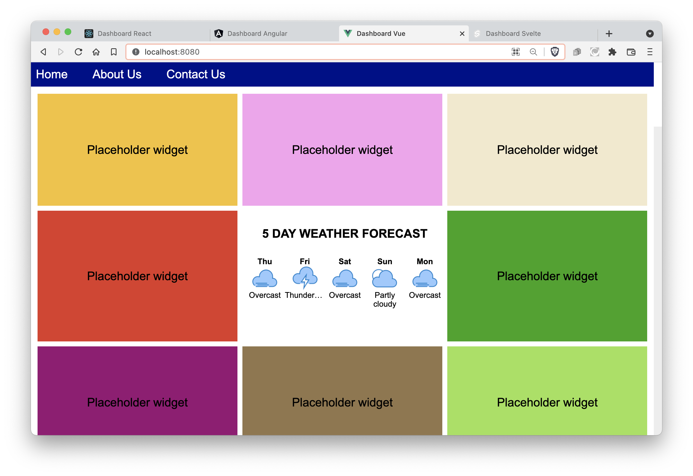

# React vs Angular vs Vue vs Svelte
The same web app written in React, Vue, Svelte, and Angular

## What is this?
You're looking at a repository holding four versions of the same **exact** web application written using different frameworks.

It's a dashboard app. It uses a bunch of placeholder widgets with random colors for simplicity but we created one widget with a five-day weather forecast for realism. This setup will demo how React, Svelte, Angular, and Vue handle:
- Responsive web design
- Consuming an API service using Ajax
- Complex layouts using CSS flexbox and grid
- Client-side routing in a SPA
- Several generations of components
- Passing props
- Maintaining component state
- Dynamically creating components

## The rules
To compare the frameworks apples-to-apples, they'll be uniform:
- Use TypeScript
- Use npm
- No CSS preprocessors (like Sass, Less, Stylus, Tailwind, etc.)
- No CSS frameworks (like Bootstrap, Material Design Lite, etc.)
- No testing so we can keep things simple.
- They must appear identical

## Dashboard app description
We're building a site whose main feature is a dashboard. 
- The site will have X "pages" and a navbar across the top. The dashboard is just one of those pages.
- Start with 25 widgets but it should flex given any number
- Responsive with one widget across on a phone. Like two across on an iPad portrait or three-ish when landscape. The widgets will be between ... ummm ... 350 and 500 pixels wide with a 16:9 aspect ratio.
- One widget will be built out. It will consume data from a CORS API hosted somewhere. The others can be placeholders for a proof-of-concept.

## How do I run the projects?
1. Fork or clone the repo (or just download the zip).
2. Go to any of the four sub-projects
3. Follow the instructions that you'll find in the individual READMEs.

Here are the projects
## [Angular](./dashboard-angular)

## [React](./dashboard-react)

## [Vue](./dashboard-vue)

## [Svelte](./dashboard-svelte)

## How are they all alike?
In the individual projects, I briefly list the differences between the frameworks but there are certain things they all share. They all ...
- Are open sourced with community contributions
- Are for web development
- Use VS Code as the de-facto standard IDE
- Create SPAs (single-page apps)
- Have a CLI (command-line interface) that scaffolds a new project
- Create a cool environment for devs that supports debugging in the browser with hot reload
- Extend HTML for looping and conditionals so that the structure can be written declaratively
- Performed well. They're all very, very fast.